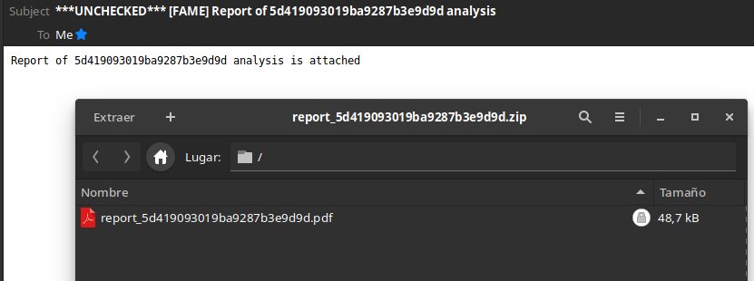
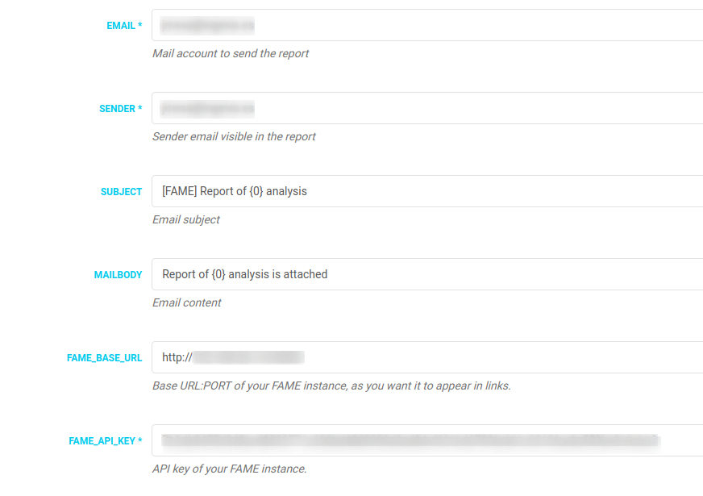

# MailReport

This module send a full PDF / HTML report of the last analysis to the selected email account. Useful if you have isolated teams with no access to the malware lab.



## Features

- PDF / HTML report.
- External CSS for easy personalization of the report.
- Privacy in communications via compressed reports with password.

## Requeriments

- Requests library
- FAME API key
- For PDF reporting, legacy version of weasyprint 0.42.3 (last version with Python 2 support).
Install Weasyprint system dependencies previously:
https://weasyprint.readthedocs.io/en/latest/install.html#linux
- 7z for compressed reports (allready installed with FAME). If not use:

## PROBLEMS?

- Always use latest pip version:
```
sudo pip install --upgrade pip
```
- If you encountered problems with attachments or text body (MIME related), check this issue:
https://github.com/certsocietegenerale/fame/pull/69

- If you are behind a proxy, configure /etc/environment and add your FAME IP to "no_proxy"
```
http_proxy="http://PROXY:PORT"
HTTP_PROXY="http://PROXY:PORT"
https_proxy="https://PROXY:PORT"
HTTPS_PROXY="https://PROXY:PORT"
no_proxy="localhost,127.0.0.1,FAME_IP"

```

## Configuration

- Example configuration



## TODO

- Preliminary proxy support.
