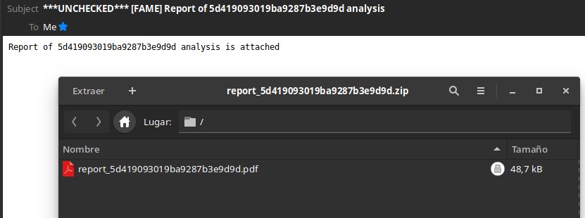
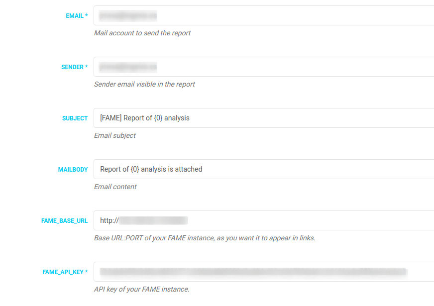

# MailReport

This module send a full PDF / HTML report of the last analysis to the selected email account. Useful if you have isolated teams with no access to the malware lab.

## Features

- PDF / HTML report.
- Privacy in communications via compressed reports with password.

## Requeriments

- Requests library
- FAME API key
- For PDF reporting, legacy version of weasyprint 0.42.3 (last version with Python 2 support)
- 7z for compressed reports (allready installed with FAME)

## TODO

- Preliminary proxy support.

## Configuration

- Example configuration

