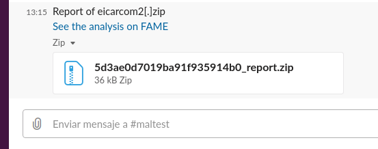
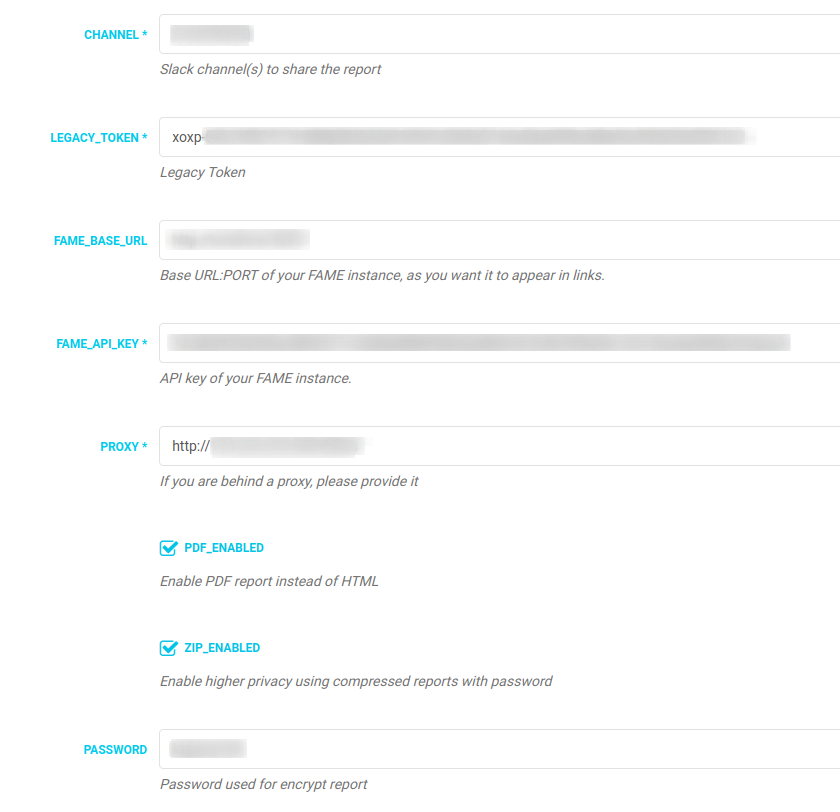

# SlackReport

This module send a full PDF / HTML report of the last analysis to the selected Slack channel. Useful if you have isolated teams with no access to the malware lab.



## Features

- PDF / HTML report.
- External CSS for easy personalization of the report.
- Privacy in communications via compressed reports with password.

## Requirements

- Requests library
- FAME API key
- For PDF reporting, legacy version of weasyprint 0.42.3 (last version with Python 2 support).
- 7z for compressed reports (allready installed with FAME). If not use:
```
sudo apt-get install p7zip-full
```
- Slack legacy token API: https://api.slack.com/custom-integrations/legacy-tokens
- Slack channel ID to use. From slack URL:
```
 https://app.slack.com/client/<team>/<channel_ID>
 -or-
 https://<slackteam>.slack.com/messages/<channel_ID>
```

## PROBLEMS?

- Always use latest pip version:
```
sudo pip install --upgrade pip
```
- If you are behind a proxy, configure /etc/environment and add your FAME IP to "no_proxy"
```
http_proxy="http://PROXY:PORT"
HTTP_PROXY="http://PROXY:PORT"
https_proxy="https://PROXY:PORT"
HTTPS_PROXY="https://PROXY:PORT"
no_proxy="localhost,127.0.0.1,FAME_IP"

```
- "dlopen() failed to load a library: cairo / cairo-2" error. Install necesary Weasyprint dependencies:
```
https://weasyprint.readthedocs.io/en/latest/install.html#linux
```
Example for Ubuntu 18:
```
sudo apt-get install build-essential python3-dev python3-pip python3-setuptools python3-wheel python3-cffi libcairo2 libpango-1.0-0 libpangocairo-1.0-0 libgdk-pixbuf2.0-0 libffi-dev shared-mime-info
```

## Configuration

- Example configuration



## TODO

- Preliminary proxy support.